# Setup
This project uses Python version `3.8`.

From the project root directory, on a [virtual Python environment](https://virtualenvwrapper.readthedocs.io/en/latest/) (or not, if you're feeling brave), run:
```bash
pip3 install -r requirements.txt
```

Make sure that the source directory is added to your `$PYTHONPATH` environment variable.

# Ejercicio 1
Entrego dos programas: `nb_n.py`, el programa original y `nb_n_gaussianas.py`, el programa modificado para outputear las medias y varianzas de las gaussianas.

Los resultados de las gaussianas para 10000 casos de `paralelo` con `d = 2` y `C = 0.78` fueron:
* Clase 0. Atributo 0. Media: -0.9896316451999999. Varianza: 0.6103653354603021
* Clase 0. Atributo 1. Media: 0.0040217697999999965. Varianza: 0.6174734188434824
* Clase 1. Atributo 0. Media: 0.9977024599999998. Varianza: 0.6038513231113908
* Clase 1. Atributo 1. Media: -0.0020161586000000016. Varianza: 0.5860021197584094

La varianza debería dar `0.6084`. Los valores son muy cercanos así que me creo que funciona bien.


# Ejercicio 2

## ANN
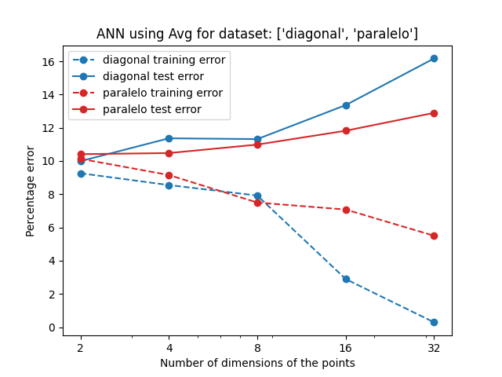


## Decision Tree


## Naive Bayes
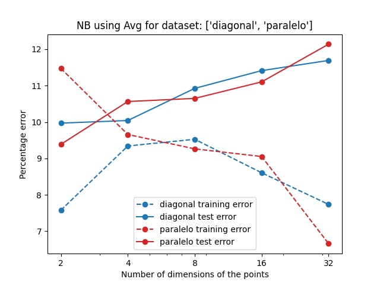


## Conclusiones
Observo que al igual que en los demás modelos, al aumentar el número de dimensiones es inevitable el sobreajuste. Hay "tan pocos puntos" (ya que se vuelve mucho menos denso) que todos los modelos aprenden clasificaciones incorrectas para ciertas regiones donde en el conjunto de entrenamiento hay una mayoría "infortuita" (casual y poco representativa de la distribución) de puntos de una clase. Esto se ve reflejado en el decrecimiento del error de training y el crecimiento de error de test.

Es muy interesante la curva del error de entrenamiento diagonal. Por la forma de aprender de Naive Bayes, supuse que ambas distribuciones le resultarían igualmente difíciles (como vemos en las curvas de test). Pero en el diagonal el error es mayor en 4 y 8 dimensiones (antes de que el sobreajuste se haga notorio). No entiendo por qué es mejor que el paralelo cuando en diagonal hay correlación entre las coordenadas (y nosotros suponemos que no), y en paralelo no la hay.

En general, veo que es un buen problema para resolver con Naive Bayes (asumo porque cumple la condición de "me parezco a lo que tengo cerca").


# Ejercicio 3

## `dos_elipses`
Mediana de 10 runs (según error de test):

```
Errores:
Entrenamiento:22.0%
Validacion:24.555555555555557%
Test:23.35%
```

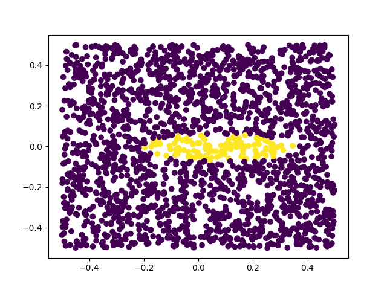

Entre ambas elipses hay puntos de la otra clase. Al tener una gaussiana para cada dimensión, ambas elipses dan la impresión de que la probabilidad máxima de la clase está en el centro del rectángulo. Esto resulta en un gran error (en comparación a otros métodos) y una predicción con una sola mancha en el centro.


## `espirales_anidadas`
Mediana de 10 runs (según error de test):

```
Errores:
Entrenamiento:44.0%
Validacion:42.11111111111111%
Test:44.26%
```

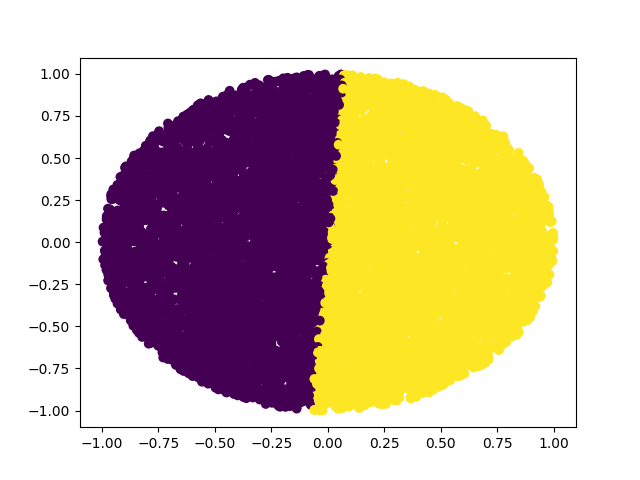

El resultado es nefasto, porque para cada dimensión las clases tienen la misma Gaussiana, resulta muy similar a tirar una moneda. Supongo que la división que escogió es producto de la distribución particular de los datos de entrenamiento.

# Ejercicio 4
Entrego dos programas: `nb_n_histogram.py`, el programa original y `nb_n_histogram_optimize.py`. El primero usa el número de bins del input. El segundo, además intenta encontrar un número de bins óptimo.

Para ambos datasets se corrieron 10 ejecuciones para cada cantidad de bins en el intervalo `[1, 200]` y se graficó la mediana de los errores (para cada cantidad de bins).

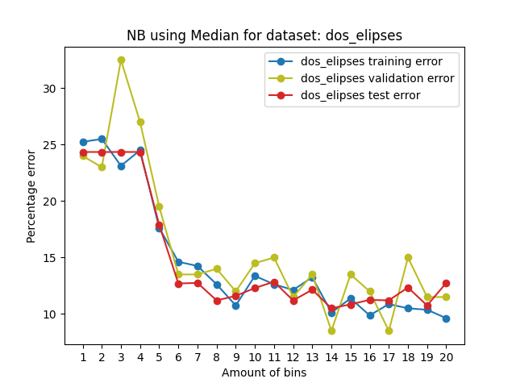

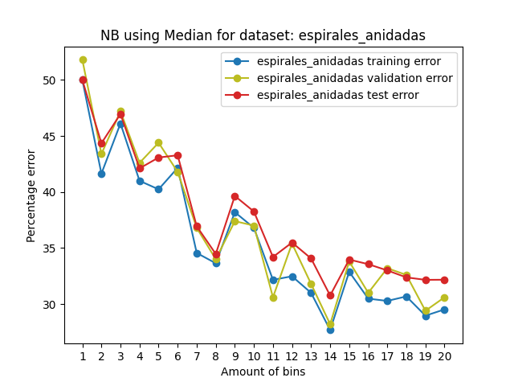

Aumentar la cantidad de bins (cosa que los achica) con la misma cantidad de puntos, aumenta la probabilidad de que casi todos los puntos en un bin sean de una sola clase. Es decir, a más bins hay más probabilidad de sobreajuste. Esto se ve claramente en los gráficos con rango `[20, 200]`:

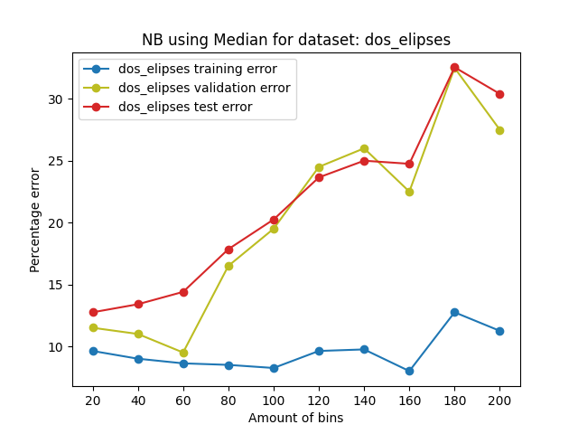

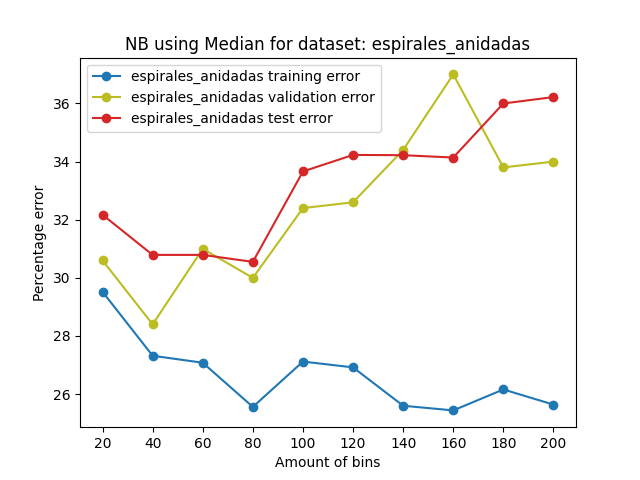


## `dos_elipses`
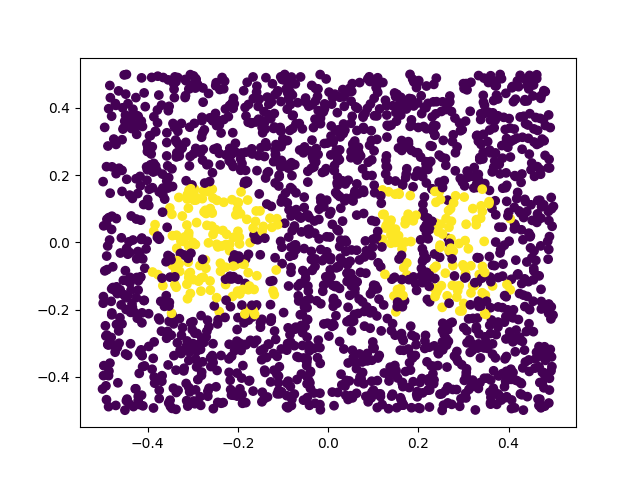

La forma del espacio de soluciones es ahora mucho más favorable. Los puntos de las elipses están claramente en sólo algunos bins, tanto para los horizontales como los verticales. Es por esto que si bien el modelo no predice elipses, logró aprender dos manchas separadas de puntos (por lo que ahora predice con mucha mayor correctitud los puntos entre las elipses).

## `espirales_anidadas`
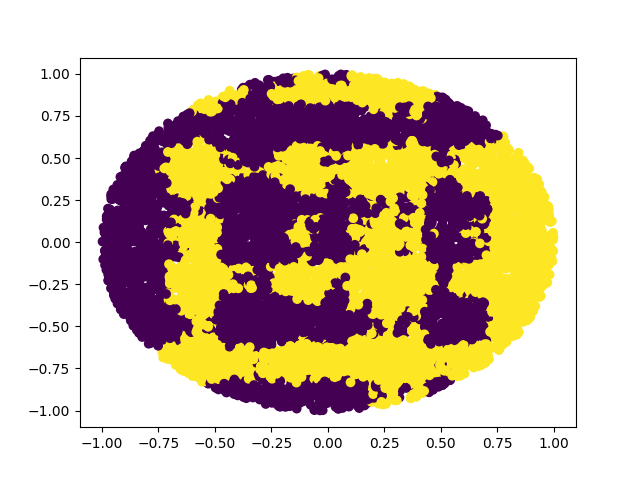

Por cómo es la distribución de las clases, hay muchos bins para los cuales hay cerca de la mitad de puntos de cada clase. Esto ocurre porque un bin es un rectángulo horizontal o vertical que recorre todo el espacio (asumimos independientes los atributos).

Es por esto que si bien la predicción mejora, el error sigue siendo alto en comparación a otros métodos.

# Ejercicio 5
Entrego dos programas: `b_n_histogram.py`, el programa original y `b_n_histogram_optimize.py`. El primero usa el número de bins del input. El segundo, además intenta encontrar un número de bins óptimo.

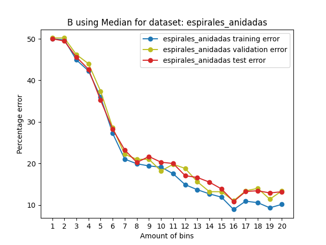

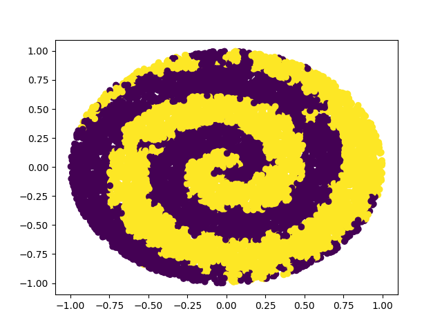

Se ve una clara mejoría a simple vista en el gráfico del archivo `.predic` (y en el gráfico de errores en general). Esto se debe a que `espirales_anidadas` es un dataset donde la clase depende de la relación entre ambas dimensiones.

Para número de bins muy grande se observa el mismo fenómeno que en el ejercicio anterior, sólo que más acentuado.

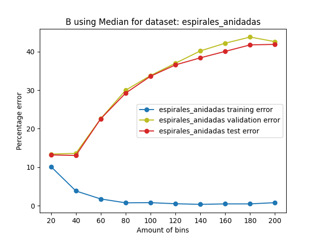

Esta implementación anda bien pero tiene el problema de que el cálculo de la probabilidad de que un punto pertenezca a una clase se vuelve cuadrático en la cantidad de features. Esto se ve en el método `ClassHistogram.probability`, que hace un cálculo lineal en la cantidad de features y luego una llamada recursiva con un feature menos:

```python
def probability(self, attributeList: List[float]) -> float:
    if attributeList:
        binList = [self.calculate_bin(attribute, value) for attribute, value in enumerate(attributeList)]
        # P(x1, ..., xn | c) = P(x1 | x2, ..., xn, c) * P(x2, ..., xn | c)
        return self.conditional_probability(binList) * self.probability(
            attributeList[1:]
        )
    else:
        return 1
```

Si no me equivoco, la complejidad final sería del orden de `O(n * d**2 * c)` siendo `n` la cantidad de puntos, `d` la cantidad de dimensiones y `c` la cantidad de clases. Para datasets no pequeños (sobre todo en dimensión) es inaplicable.

# Ejercicio 6

Bayes volvió a ser Naive para este ejercicio. No tiene sentido usar un conjunto de validación en este caso, ya que la cantidad de bins está dada por el algoritmo (y no es un parámetro a optimizar). Consecuentemente, entrego un solo programa nuevo, `nb_n_entropy_histogram.py` basado en `nb_n_histogram.py` del ejercicio 4.

Tuve que cambiar bastante la estructura del programa (😢), porque estaba usando un objeto `Histogram` para cada clase de los datos. Reescribí una parte grande con `pandas` porque pasó casi un año y aprendí cosas nuevas. No fui muy feliz haciendo esa mezcla de código viejo y nuevo, aunque reconozco que me da una sensación de progreso el pensar que hace un año no entendía nada (seguro ahora tampoco entiendo tanto, pero sí entiendo más).

```
Errores:
Entrenamiento: 3.5000000000000004%
Test: 3.95%
```

Pero valió la pena! Dio increíblemente bien. Me resulta muy interesante que elegir bins "inteligentemente" haya mejorado tanto los errores. Chusmeando los bins vi que se concentran en los intervalos de la coordenada donde están las elipses. Como cierre dejo la predicción graficada:

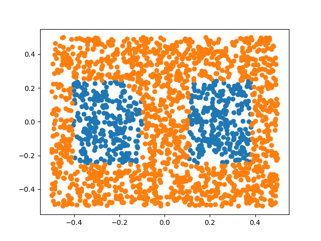

Los bins andan hermoso. Sí se nota el problema de la dependencia de las coordenadas, al asumirlas independientes grafica dos rectángulos en los intervalos de coordenadas donde estaban las elipses.