# Setup
This project uses Python version `3.8`.

From the project root directory, on a [virtual Python environment](https://virtualenvwrapper.readthedocs.io/en/latest/) (or not, if you're feeling brave), run:
```bash
pip3 install -r requirements.txt
```

Make sure that the source directory is added to your `$PYTHONPATH` environment variable.

# Consideraciones generales
Al igual que el TP de Naive Bayes, ya había programado bastante en este TP. Me esforcé más en refactorizarlo, pero aún así quedaron algunas mezclas.

Cuando tuve que optimizar `k` lo hice tomando el mejor de: `[1, 2, 3, 4, 5, 10, 15, 20, 40, 60, 80, 100]`.

# Ejercicio a
Entrego dos programas:

* `k_nn.py` corre una ejecución de K-NN con la configuración dada.
* `k_nn_optimize.py` corre varias veces K-NN para distintos valores de k y elige el que menor error de validación tiene (usando un único conjunto de validación cuyo tamaño se define en el archivo de configuración).

Ambos leen la configuración de un archivo `.knn`, los datos de entrenamiento (y validación) de un archivo `.data` y los datos de test de un archivo `.test`. Pueden escribir los errores en un archivo `.err` y la predicción en un archivo `.predic`.

# Ejercicio b

* `generate_errors.py` ejecuta muchas veces `k_nn.py` para diferentes `k` y guarda los errores en un mismo archivo `.err`.
* `plot_errors.py` levanta un `.err` generado por `generate_errors.py` y grafica la mediana de los errores.
* `plot_predic.py` hace un scatter plot de un archivo `.predic`.

`generate_errors.py` está en la carpeta `a` porque me era más fácil tenerlo en la misma carpeta que el K-NN. Los demás archivos están todos en la carpeta `b`.

A la hora de comparar con árboles de decisión usé [`DecisionTreeClassifier` de scikit](https://scikit-learn.org/stable/modules/generated/sklearn.tree.DecisionTreeClassifier.html?highlight=decisiontree#sklearn.tree.DecisionTreeClassifier) porque me parece que a fines de comparar resultados es lo mismo y era más rápido para mí que reaprender cómo usar la implementación de C4.5 que nos diste. Usé `criterion = "entropy"`, que entiendo funciona igual que C4.5. Por default no hace pruning y considera todas las variables en cada nodo.

## `espirales_anidadas`
Archivo de configuración:

```
1
2
3000
2500
10000
0
0

# los parametros corresponden a:
# K:      cantidad de vecinos a tener en cuenta
# N_IN:        CANTIDAD DE ENTRADAS
# PTOT:   cantidad TOTAL de patrones en el archivo .data
# PR:     cantidad de patrones de ENTRENAMIENTO
# PTEST:  cantidad de patrones de test (archivo .test)
# SEED:   semilla para el rand()
# CONTROL:verbosity
```

### Error según `k`

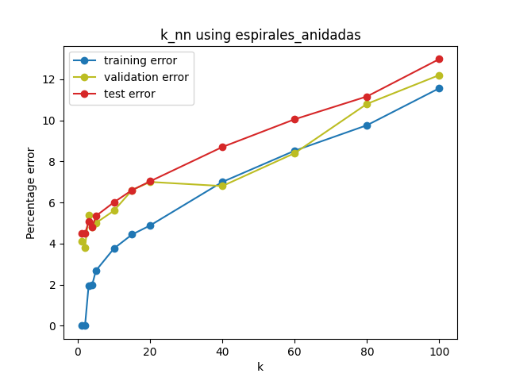

Para `k=1` y `k=2` el error de entrenamiento es 0 porque el punto más cercano a un punto de entrenamiento es sí mismo. Es interesante cómo el error de validación sigue al de test, por lo que el método parece no sobreajustar. Además, para `k` cada vez mayores se pierde la idea de localidad y en su lugar gana "la clase con más puntos", que en este caso para muchas regiones es prácticamente un 50/50 de cada clase. Así va empeorando el resultado.

### Comparación con Árboles de Decisión

Corriendo `k_nn_optimize.py` obtengo:
```
k óptimo: 10
Error de entrenamiento: 3.2%
Error de validación: 4.6%
Error de test: 5.7299999999999995%
```

Y corriendo `decision_tree.py`:
```
Decision Tree test error: 5.89%
```

Un error muy similar.

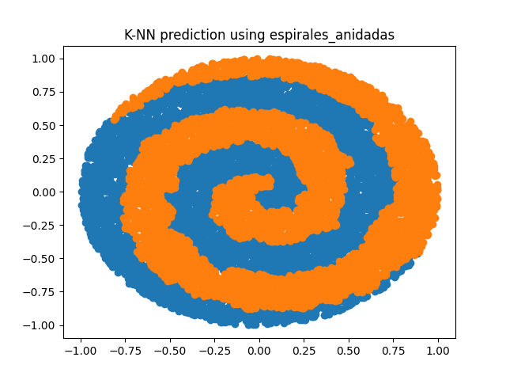
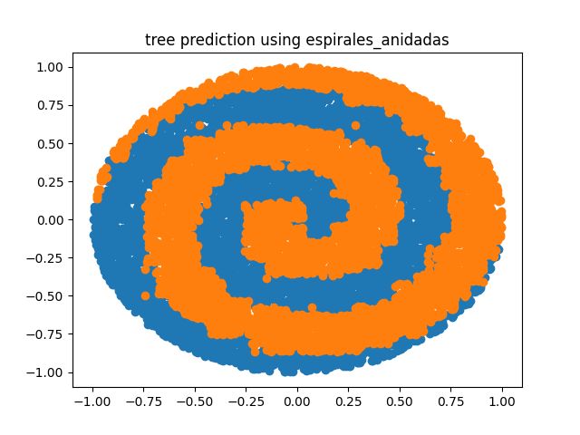

Se ve claramente el bias de cada método. La predicción de árboles resulta muy angulosa (y los errores se encuentran allí) mientras que para KNN se ven las regiones en el espacio donde en el dataset de training hay (por mala suerte) más concentración de una clase. Por ejemplo, cerca del centro la región naranja se expande más de lo que debería.

## `c_2` (espirales con ruido)
Asumo que querés que descartemos `c_0` y usemos `c_2`, que es el dataset con ruido.

Archivo de configuración:

```
1
4
1000
800
4000
0
0

# los parametros corresponden a:
# K:      cantidad de vecinos a tener en cuenta
# N_IN:        CANTIDAD DE ENTRADAS
# PTOT:   cantidad TOTAL de patrones en el archivo .data
# PR:     cantidad de patrones de ENTRENAMIENTO
# PTEST:  cantidad de patrones de test (archivo .test)
# SEED:   semilla para el rand()
# CONTROL:verbosity
```

### Error según `k`

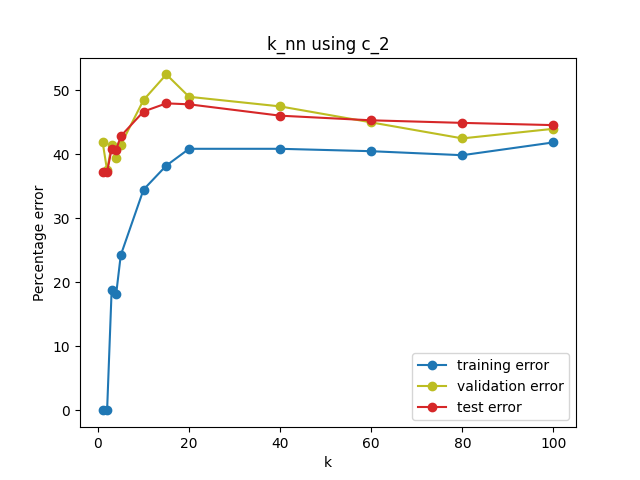

Anda muy mal siempre, K-NN es muy susceptible a dimensiones con ruido (porque en esta implementación considera a todas las dimensiones por igual). Nuevamente, para `k=1` y `k=2` el error de entrenamiento es 0 por la misma razón (y se mantiene bajo al comienzo). Parece no sobreajustar, aunque es difícil de decir cuando el error es tan alto.

### Comparación con Árboles de Decisión

Corriendo `k_nn_optimize.py` obtengo:
```
k óptimo: 1
Error de entrenamiento: 0.0%
Error de validación: 40.5%
Error de test: 36.475%
```

Y corriendo `decision_tree.py`:
```
Decision Tree test error: 12.45%
```

Si bien ya sabíamos que los árboles de decisión tienen cierta robustez al ruido, esto me resulta sospechosamente bueno. La implementación de `scikit` debe hacer alguna triquiñuela.


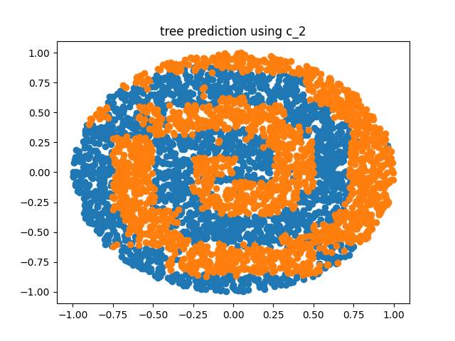

En la predicción de árboles se ve nuevamente el bias, sólo que esta vez algunos "rectangulitos" son del color incorrecto (por el ruido). En la de K-NN no se entiende nada, porque me parezco "a lo que tengo cerca" pero dos de las cuatro dimensiones que uso me intoxican la verdadera distancia.

# Ejercicio c

Como siempre, considero las dimensiones `[2, 4, 8, 16, 32]`.

Todos los archivos se encuentran en la carpeta `c`:

* `k_nn.py` y `k_nn_optimize.py`, copias del ejercicio 1 pero que ahora outputean sólo error de entrenamiento y de test en el formato en el que lo espera `generate_errors.py`.
* `generate_errors.py`, el script que para cada dimensión corre los generadores de datasets, el script de K-NN, escribe los errores en archivos `.err` y hace el cleanup. Dejé los parámetros igual que en los TPs anteriores (`C = 0.78`, `trainingSize = 250`, `testSize = 10000`), pero reduje la cantidad de iteraciones a 7 (sigo tomando la mediana de los errores).
* `plot_errors.py`, el graficador.
* `diagonal` y `paralelo`, los ejecutables que generan los datasets. Le creé a cada uno un `.knn` de configuración.
* Gráficos de los métodos anteriores más los generados para este TP.

A partir de ahora no muestro más las configuraciones de los archivos `.knn` porque creo que no aportan nada.

## Métodos anteriores.

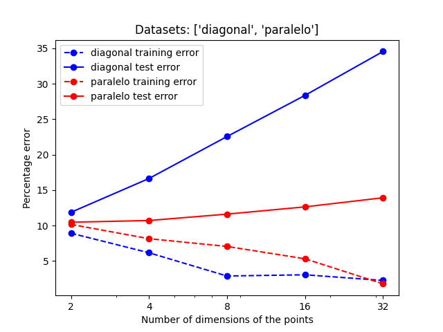

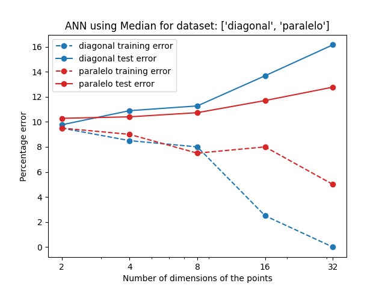

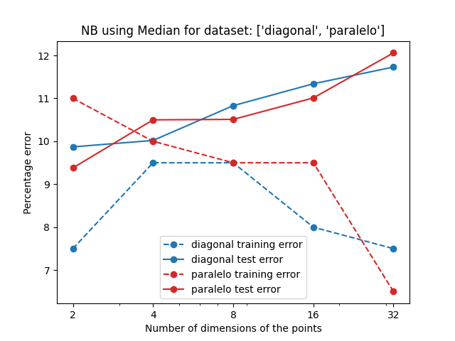

## K-NN con `k=1`

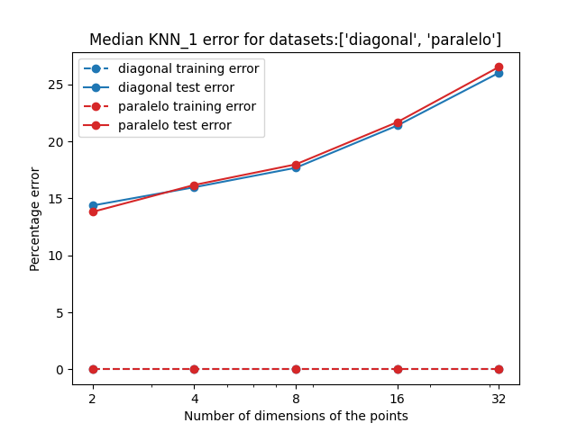

El error de training no me sirve para nada (por lo ya comentado). El error de test se dispara violentamente, es lo más parecido a lo que ocurría con `diagonal` y árboles de decisión que veo desde entonces (si bien no es tan malo). Observo que ambos problemas son igual de difíciles para el método. El aumento de la dimensionalidad y el hecho de considerar un solo vecino hace muy volátil la clasificación.

## K-NN con `k` óptimo.
Los `k` moda para cada dimensión fueron:
```
diagonal
d  2,  4,  8, 16, 32
k 10,  3, 10, 80, 20

paralelo
d  2,  4,  8, 16, 32
k 10,  3, 15, 20, 60
```

Es interesante la idea de "a dimensiones más altas el `k` óptimo aumenta", que no es del todo verdad en este caso (pero suena razonable compensar el aumento de varianza por dimensionalidad con un `k` mayor).

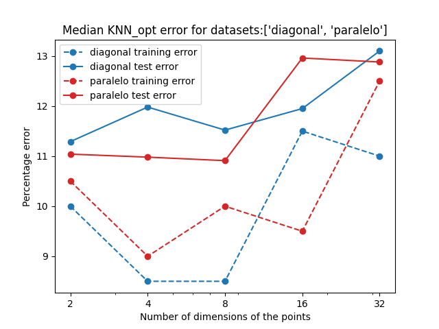

¡Wow! Es muy estable. Por supuesto que empeora, pero es mucho mucho mejor que el caso anterior. Esperaba mejoría, pero no tanta (esperaba que fuera notablemente peor que ANN o NB). Parece que mi idea de que va aumentando el k tiene algo de sentido.

# Ejercicio d

Me copié algunos archivos de `c`. La novedad es la implementación de K-NN, `nn_radius.py`, que intenta optimizar un radio en el que mira vecinos (mira todos los vecinos en ese radio). Si no hay puntos en el radio, toma la clase del punto más cercano.

Para elegir `max_dist` usé 10 valores en un [intervalo logarítmicamente equiespaciado](https://numpy.org/doc/stable/reference/generated/numpy.logspace.html) entre la mínima y la máxima distancia entre dos puntos de entrenamiento.

Los `radius` promedio para cada dimensión se pueden ver en el `.err`. Sólo me interesa destacar que para 8, 16 y 32 dimensiones es prácticamente 0, por lo que el clasificador se vuelve 1-NN (y consecuentemente anda igual de mal). Qué raro que el algoritmo haya elegido esos valores... imaginaba que en validación daría lo suficientemente mal para que escoja `radius` mayores.

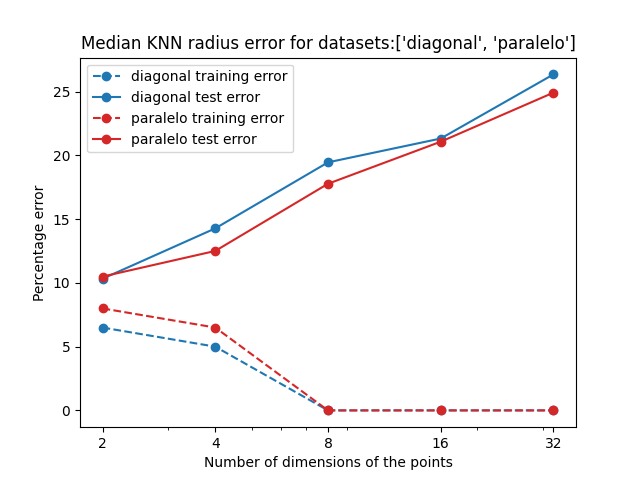

Es sólo apenas mejor que 1-NN. Me echo la culpa a mí y a mi elección de parámetros. Quizás debería haber generado `radius` mayores (con un método distinto) para lograr `k` equivalentes mayores.

# Ejercicio e
Entrego versiones modificadas de `k_nn.py` y `k_nn_optimize.py` de la carpeta `a` que hacen regresión (y acordemente se llaman `k_nn_regression.py` y `k_nn_regression_optimize.py`). También usé una copia exacta de `generate_errors.py` de `a` y `plot_errors.py` de `b`.

La regresión está hecha con la cuenta vista en clase:
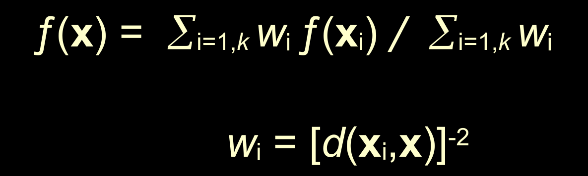

Esto me obligó a incluir un check que quite a los puntos con distancia 0 (es decir, miro los primeros `k` vecinos con distancia positiva).

## Con `k` óptimo

```
k óptimo: 15
Error de entrenamiento: 1.3463288135242617%
Error de validación: 1.0159458700666486%
Error de test: 1.0818026798025375%
```

¡Anduvo muy bien (y muy rápido)! Me pone contento. Es interesante cómo ahora obligar al entrenamiento a usar puntos distintos al que queremos predecir empeora el error (¡y lo vuelve el más alto de los tres!). Entiendo que es necesario, pero me parece feo que pase.

## Comparación con ANN

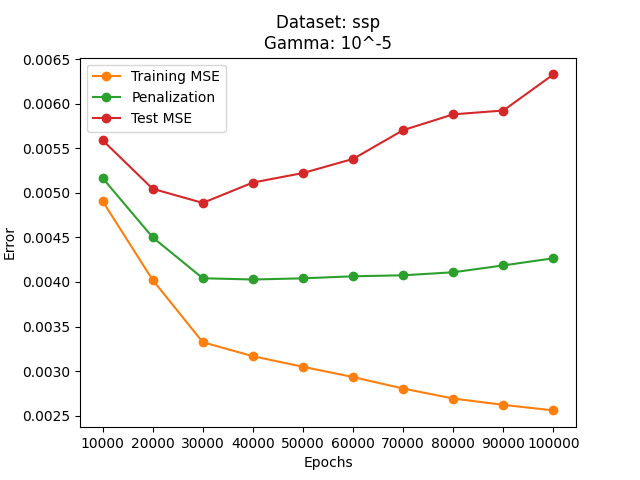

Había muchos `gamma` para elegir. Me quedé con este gráfico porque en el informe del TP de ANN dije que me había gustado.

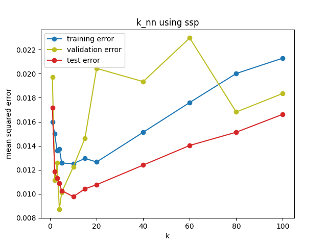

Muy bien. Veo que training sigue sufriendo de "no me puedo usar a mí mismo", lo que se nota sobre todo para k pequeños. El error de validación es muy volátil, culpo a la poca cantidad de puntos (usé 1/5 del dataset, pero son 36 puntos nada más). En comparación a ANN el MSE es un poco más que el doble, que para la diferencia abismal de velocidad (en este dataset pequeño) está más que bien. En general me llevo una imagen mucho más positiva de K-NN de lo que esperaba (tanto en clasificación como en regresión).