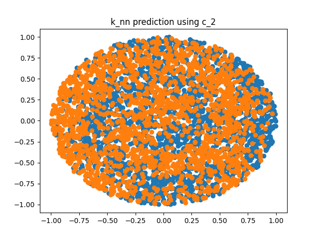

# Setup
This project uses Python version `3.8`.

From the project root directory, on a [virtual Python environment](https://virtualenvwrapper.readthedocs.io/en/latest/) (or not, if you're feeling brave), run:
```bash
pip3 install -r requirements.txt
```

Make sure that the source directory is added to your `$PYTHONPATH` environment variable.

# Consideraciones generales
Al igual que el TP de Naive Bayes, ya había programado bastante en este TP. Me esforcé más en refactorizarlo, pero aún así quedaron algunas mezclas.

A la hora de comparar con árboles de decisión usé [`DecisionTreeClassifier` de scikit](https://scikit-learn.org/stable/modules/generated/sklearn.tree.DecisionTreeClassifier.html?highlight=decisiontree#sklearn.tree.DecisionTreeClassifier) porque me parece que a fines de comparar resultados es lo mismo y era más rápido para mí que reaprender cómo usar la implementación de C4.5 que nos diste. Usé `criterion = "entropy"`, que entiendo funciona igual que C4.5. Por default no hace pruning y considera todas las variables en cada nodo.

# Ejercicio a
Entrego dos programas:

* `k_nn.py` corre una ejecución de K-NN con la configuración dada.
* `k_nn_optimize.py` corre varias veces K-NN para distintos valores de k y elige el que menor error de validación tiene (usando un único conjunto de validación cuyo tamaño se define en el archivo de configuración).

Ambos leen la configuración de un archivo `.knn`, los datos de entrenamiento (y validación) de un archivo `.data` y los datos de test de un archivo `.test`. Pueden escribir los errores en un archivo `.err` y la predicción en un archivo `.predic`.

# Ejercicio b

* `generate_errors.py` ejecuta muchas veces `k_nn.py` para diferentes `k` y guarda los errores en un mismo archivo `.err`.
* `plot_errors.py` levanta un `.err` generado por `generate_errors.py` y grafica la mediana de los errores.
* `plot_predic.py` hace un scatter plot de un archivo `.predic`.

`generate_errors.py` está en la carpeta `a` porque me era más fácil tenerlo en la misma carpeta que el K-NN. Los demás archivos están todos en la carpeta `b`.


## `espirales_anidadas`
Archivo de configuración:

```
1
2
3000
2500
10000
0
0

# los parametros corresponden a:
# K:      cantidad de vecinos a tener en cuenta
# N_IN:        CANTIDAD DE ENTRADAS
# PTOT:   cantidad TOTAL de patrones en el archivo .data
# PR:     cantidad de patrones de ENTRENAMIENTO
# PTEST:  cantidad de patrones de test (archivo .test)
# SEED:   semilla para el rand()
# CONTROL:verbosity
```

### Error según `k`


Para `k=1` y `k=2` el error de entrenamiento es 0 porque el punto más cercano a un punto de entrenamiento es sí mismo. Es interesante cómo el error de validación sigue al de test, por lo que el método parece no sobreajustar. Además, para `k` cada vez mayores se pierde la idea de localidad y en su lugar gana "la clase con más puntos", que en este caso para muchas regiones es prácticamente un 50/50 de cada clase. Así va empeorando el resultado.

### Comparación con Árboles de Decisión

Corriendo `k_nn_optimize.py` obtengo:
```
k óptimo: 10
Error de entrenamiento: 3.2%
Error de validación: 4.6%
Error de test: 5.7299999999999995%
```

Y corriendo `decision_tree.py`:
```
Decision Tree test error: 5.89%
```

Un error muy similar.


Se ve claramente el bias de cada método. La predicción de árboles resulta muy angulosa (y los errores se encuentran allí) mientras que para KNN se ven las regiones en el espacio donde en el dataset de training hay (por mala suerte) más concentración de una clase. Por ejemplo, cerca del centro la región naranja se expande más de lo que debería.

## `c_2` (espirales con ruido)
Asumo que querés que descartemos `c_0` y usemos `c_2`, que es el dataset con ruido.

Archivo de configuración:

```
1
4
1000
800
4000
0
0

# los parametros corresponden a:
# K:      cantidad de vecinos a tener en cuenta
# N_IN:        CANTIDAD DE ENTRADAS
# PTOT:   cantidad TOTAL de patrones en el archivo .data
# PR:     cantidad de patrones de ENTRENAMIENTO
# PTEST:  cantidad de patrones de test (archivo .test)
# SEED:   semilla para el rand()
# CONTROL:verbosity
```

### Error según `k`


Anda muy mal siempre, K-NN es muy susceptible a dimensiones con ruido (porque en esta implementación considera a todas las dimensiones por igual). Nuevamente, para `k=1` y `k=2` el error de entrenamiento es 0 por la misma razón (y se mantiene bajo al comienzo). Parece no sobreajustar, aunque es difícil de decir cuando el error es tan alto.

### Comparación con Árboles de Decisión

Corriendo `k_nn_optimize.py` obtengo:
```
k óptimo: 1
Error de entrenamiento: 0.0%
Error de validación: 40.5%
Error de test: 36.475%
```

Y corriendo `decision_tree.py`:
```
Decision Tree test error: 12.45%
```

Si bien ya sabíamos que los árboles de decisión tienen cierta robustez al ruido, esto me resulta sospechosamente bueno. La implementación de `scikit` debe hacer alguna triquiñuela.




En la predicción de árboles se ve nuevamente el bias, sólo que esta vez algunos "rectangulitos" son del color incorrecto (por el ruido). En la de K-NN no se entiende nada, porque me parezco "a lo que tengo cerca" pero dos de las cuatro dimensiones que uso me intoxican la verdadera distancia.


